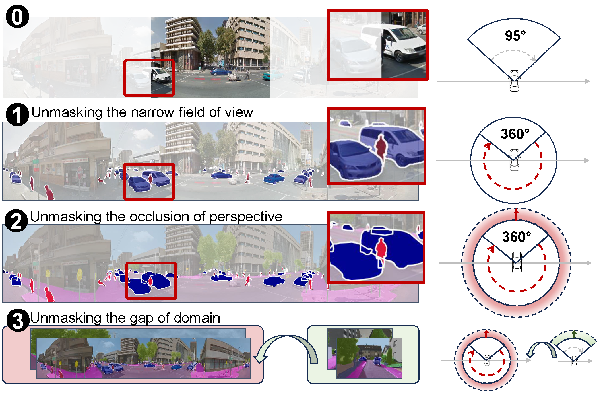
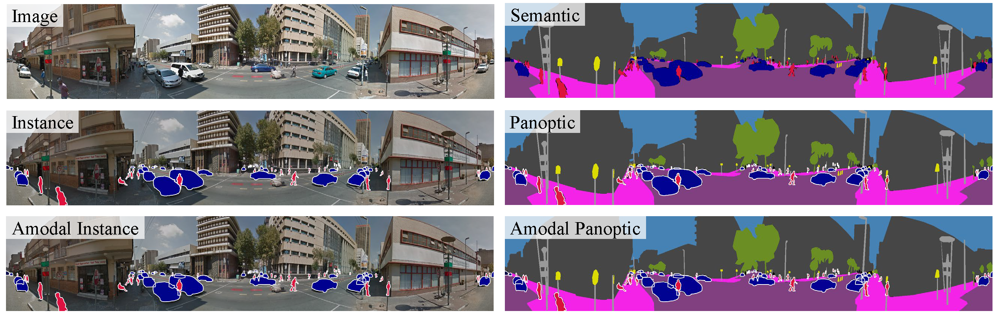

<p align="center">
<h1 align="center"><strong>Occlusion-Aware Seamless Segmentation</strong></h1>
<h3 align="center">ECCV 2024</h3>

<p align="center">
    <a href="">Yihong Cao</a><sup>1*</sup>,</span>
    <a href="">Jiaming Zhang</a><sup>2*</sup>,
    <a href="">Hao Shi</a><sup>3</sup>,
    <a href="">Kunyu Peng</a><sup>2</sup>,
    <a href="">Yuhongxuan Zhang</a><sup>1</sup>,
    <a href="">Hui Zhang</a><sup>1†</sup>,
    <a href="">Rainer Stiefelhagen</a><sup>2</sup>,
    <a href="">Kailun Yang</a><sup>1†</sup>
    <br>
        <sup>1</sup>Hunan University,
        <sup>2</sup>Karlsruhe Institute of Technology,
        <sup>3</sup>Zhejiang University
</p>

## [OASS Task](https://arxiv.org/pdf/2407.02182)
<div align="left">
  
</div>

## Datasets
### [BlendPASS](https://github.com/yihong-97/BlendPASS)
Considering the scalability of future work, we annotated 100 images containing 2,960 objects across various classes in the evaluation set, following the format of Cityscapes. For more details, please visit the [BlendPASS homepage](https://github.com/yihong-97/BlendPASS) or download directly [here](https://drive.google.com/drive/folders/1t-dUjH4zeu4fBhtr6AbKULjnbSWKje0S?usp=sharing).
<div align="left">
  
</div>

###  KITTI360-APS-to-BlendPASS
Due to inconsistent class structures between KITTI360-APS and BlendPASS, we coarsely aligned the 8 class targets from BlendPASS to match the 7 classes in KITTI360-APS. The converted dataset can be downloaded directly [here]().

## Usage
### Installation
```
pytorch==1.7.1
torchvision==0.8.2
torchaudio==0.7.2
cudatoolkit=10.2
mmcv-full==1.6.2
```
To facilitate your testing, we have packaged our dependencies. You can download them [here]() and extract directly into your Anaconda virtual environment folder.

### Datasets
**Source:** KITTI360-APS

Please refer to the homepage of KITTI360-APS. We also provide the dataset, which is available [here]().


**Target:** BlendPASS

### Train
```shell
python run_experiments.py --config configs/unmaskformer/Training_OASS_UnmaskFormer.py
```

### Evaluation
Our pretrained model is available at [here]().
```shell
python run_experiments.py --config configs/unmaskformer/Testing_UnmaskFormer.py
```

## 🤝 Publication:
Please consider referencing this paper if you use the ```code``` or ```data``` from our work.
Thanks a lot :)

```
@inproceedings{cao2024oass,
  title={Occlusion-Aware Seamless Segmentation},
  author={Yihong Cao and Jiaming Zhang and Hao Shi and Kunyu Peng and Yuhongxuan Zhang and Hui Zhang and Rainer Stiefelhagen and Kailun Yang},
  booktitle={European Conference on Computer Vision (ECCV)},
  year={2024}
}
```
## Acknowledgement:

This project is based on the following open-source projects. We thank their
authors for making the source code publically available.

* [DAFormer](https://github.com/lhoyer/DAFormer)
* [MMDetection](https://github.com/open-mmlab/mmdetection)
* [MMSegmentation](https://github.com/open-mmlab/mmsegmentation)
* [EDAPS](https://github.com/susaha/edaps)

## License

This project is released under the [Apache License 2.0](LICENSE), while some 
specific features in this repository are with other licenses. Please refer to 
[LICENSES.md](LICENSES.md) for the careful check, if you are using our code for 
commercial matters.
